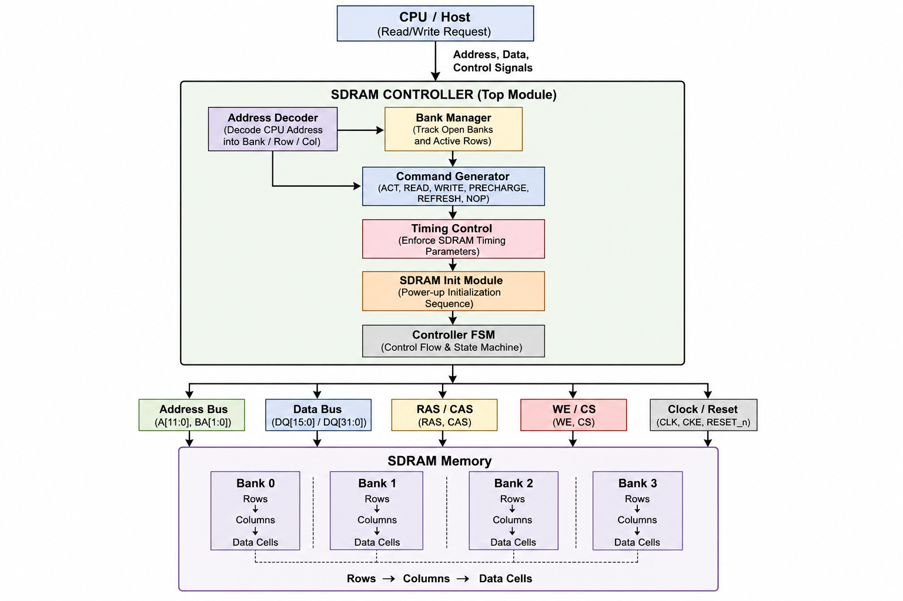
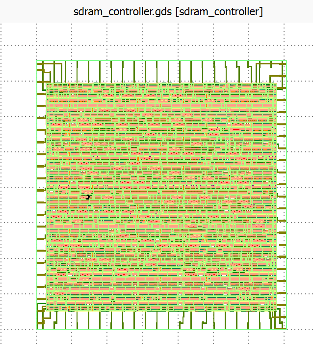

# SDRAM Controller ASIC Architecture

> **Project:** SDRAM Controller ASIC  
> **Document:** Architecture Specification  
> **Language:** Verilog HDL  
> **Target:** RTL Design and Functional Verification  
> **Document Version:** 1.0

---

# 1. Introduction

## 1.1 Overview

The SDRAM Controller is a digital hardware module responsible for managing communication between a host processor and an external Synchronous Dynamic Random Access Memory (SDRAM). Unlike SRAM, SDRAM requires precise command sequencing, row management, initialization procedures, and strict timing compliance before any memory transaction can occur.

The controller abstracts the complexity of SDRAM operation by translating simple CPU read/write requests into valid SDRAM command sequences while ensuring all protocol timing requirements are satisfied.

The controller presented in this project is designed as a modular RTL architecture, making every functional block independently verifiable and reusable in larger ASIC or SoC designs.

---

## 1.2 Objectives

The architecture is designed to:

- Decode CPU addresses into SDRAM Bank, Row, and Column addresses.
- Maintain the status of every SDRAM bank.
- Generate legal SDRAM commands.
- Execute SDRAM initialization after reset.
- Coordinate all controller operations through a finite state machine.
- Provide a scalable architecture for future SDRAM/DDR controllers.

---

# 2. System Architecture

The controller sits between the CPU (Host Interface) and the SDRAM device.

The CPU issues a memory request containing an address, data, and control signals. The controller interprets the request, determines the target bank and row, generates the appropriate SDRAM command sequence, and interfaces with the SDRAM using standard memory control signals.

The overall architecture is divided into independent hardware modules to simplify development, verification, and maintenance.

---

## Functional Responsibilities

| Module | Responsibility |
|---------|----------------|
| Address Decoder | Converts CPU address into Bank, Row, and Column |
| Bank Manager | Tracks open banks and active rows |
| SDRAM Initialization | Executes power-up initialization sequence |
| Command Generator | Produces SDRAM commands |
| Controller FSM | Controls transaction sequencing |
| Timing Controller *(Future)* | Enforces SDRAM timing constraints |

---

# 3. Top-Level Block Diagram

**Placeholder**

```
[Figure 3.1 Top-Level SDRAM Controller Architecture]
```

The top-level architecture illustrates the interaction between the host processor, controller modules, and the SDRAM device.

The CPU provides memory requests to the controller. Internal modules cooperate to determine the target memory location, generate legal SDRAM commands, and drive the external memory interface.

---

# 4. Module Hierarchy

```
SDRAM Controller
│
├── Address Decoder
├── Bank Manager
├── SDRAM Initialization
├── Command Generator
├── Controller FSM
└── Timing Controller (Future)
```


The hierarchy follows a modular architecture where each block performs a single well-defined function.

---

# 5. Module Descriptions

---

# 5.1 SDRAM Controller Top Module

The SDRAM Controller Top Module is the integration point of the complete design.

It receives memory requests from the processor and coordinates all internal modules to execute legal SDRAM transactions.

## Responsibilities

- Receive CPU requests
- Coordinate internal modules
- Interface with SDRAM
- Route decoded addresses
- Trigger initialization
- Control transaction sequencing

## Inputs

- Clock
- Reset
- CPU Address
- CPU Write Data
- Read Enable
- Write Enable

## Outputs

- SDRAM Address Bus
- SDRAM Bank Address
- SDRAM Command Signals
- Data Bus
- Read Data

---

# 5.2 Address Decoder

The Address Decoder converts the processor's linear memory address into the three addressing fields required by SDRAM.

Unlike conventional memories, SDRAM internally organizes memory into banks, rows, and columns.

The decoder partitions the incoming address into:

- Bank Address
- Row Address
- Column Address

This translation enables the controller to determine the exact physical memory location associated with each CPU request.

## Responsibilities

- Decode CPU address
- Extract Bank bits
- Extract Row bits
- Extract Column bits

## Inputs

- CPU Address

## Outputs

- Bank Address
- Row Address
- Column Address

**Placeholder**

```
[Figure 5.1 Address Decoder]
```

---

# 5.3 Bank Manager

SDRAM banks retain an active row after an ACTIVATE command. Subsequent accesses to the same row can proceed directly without reopening the row.

The Bank Manager tracks the status of every SDRAM bank.

For each bank it stores:

- Bank Open/Closed Status
- Active Row Address

This information allows the controller to determine whether:

- A Row Hit has occurred.
- A Row Miss has occurred.
- A Precharge operation is required.

## Responsibilities

- Maintain bank state
- Store active rows
- Detect row hits
- Detect row conflicts
- Process activate/precharge updates

## Inputs

- Bank
- Row
- Activate
- Precharge
- Clock
- Reset

## Outputs

- Bank Open
- Active Row

**Placeholder**

```
[Figure 5.2 Bank Manager]
```

---

# 5.4 SDRAM Initialization Module

After power-up, SDRAM devices require a mandatory initialization sequence before accepting normal memory commands.

The Initialization Module generates this startup sequence according to the SDRAM specification.

Typical sequence:

1. Wait for power stabilization.
2. Issue PRECHARGE ALL.
3. Perform Auto Refresh operations.
4. Load Mode Register.
5. Indicate Initialization Complete.

The controller blocks normal memory accesses until initialization finishes successfully.

## Responsibilities

- Execute startup sequence
- Generate initialization commands
- Signal initialization completion

## Inputs

- Clock
- Reset

## Outputs

- Initialization Complete
- Initialization Commands

**Placeholder**

```
[Figure 5.3 SDRAM Initialization Sequence]
```

---

# 5.5 Command Generator

The Command Generator converts high-level controller actions into valid SDRAM command encodings.

Every SDRAM operation is represented by a unique combination of control signals.

Supported commands include:

- NOP
- ACTIVE
- READ
- WRITE
- PRECHARGE
- AUTO REFRESH
- LOAD MODE REGISTER

The module ensures that the correct command is produced for each stage of a transaction.

## Responsibilities

- Generate SDRAM commands
- Encode control signals
- Interface with Controller FSM

## Inputs

- Controller State
- Read Request
- Write Request
- Bank Status

## Outputs

- RAS#
- CAS#
- WE#
- CS#


# 6. Data Flow

The SDRAM Controller processes memory requests through a structured pipeline.

1. CPU issues a read or write request.
2. Address Decoder extracts Bank, Row, and Column fields.
3. Bank Manager checks the state of the target bank.
4. Controller FSM determines the required sequence.
5. Command Generator produces SDRAM commands.
6. Commands are transmitted to the SDRAM.
7. Read or write data is exchanged over the data bus.
8. The transaction completes and the controller returns to the idle state.


# 7. Command Flow

Each memory request is translated into a sequence of SDRAM commands.

### Example Read Sequence

```
ACTIVE
↓

Wait tRCD

↓

READ

↓

Wait CAS Latency

↓

Receive Data
```

### Example Write Sequence

```
ACTIVE
↓

Wait tRCD

↓

WRITE

↓

Transfer Data

↓

(Optional PRECHARGE)
```


# 8. State Machine

The controller is governed by a finite state machine (FSM) that ensures correct sequencing of SDRAM operations.

## Primary States

- RESET
- INITIALIZATION
- IDLE
- ADDRESS DECODE
- BANK CHECK
- ACTIVATE
- READ
- WRITE
- PRECHARGE
- REFRESH *(Future)*
- COMPLETE

Each state performs a dedicated function before transitioning to the next based on controller conditions and SDRAM timing requirements.


# 9. Signal Description

## Host Interface

| Signal | Direction | Description |
|----------|-----------|-------------|
| clk | Input | System clock |
| reset | Input | Active-high reset |
| cpu_address | Input | CPU memory address |
| write_data | Input | Data from CPU |
| read_enable | Input | Read request |
| write_enable | Input | Write request |
| read_data | Output | Data returned to CPU |

---

## SDRAM Interface

| Signal | Direction | Description |
|----------|-----------|-------------|
| A[] | Output | Row/Column Address |
| BA[] | Output | Bank Address |
| DQ[] | Inout | Data Bus |
| CS# | Output | Chip Select |
| RAS# | Output | Row Address Strobe |
| CAS# | Output | Column Address Strobe |
| WE# | Output | Write Enable |
| CLK | Output | SDRAM Clock |
| CKE | Output | Clock Enable |

---

# 10. Inter-Module Communication

The controller modules exchange information through well-defined interfaces.

| Source Module | Destination Module | Information |
|---------------|--------------------|-------------|
| Top Module | Address Decoder | CPU Address |
| Address Decoder | Bank Manager | Bank, Row |
| Bank Manager | Controller FSM | Bank Status |
| Controller FSM | Command Generator | Operation Type |
| Command Generator | SDRAM | SDRAM Commands |
| Initialization Module | Controller FSM | Initialization Complete |

This modular communication minimizes coupling between blocks, improving maintainability and enabling independent verification.

---

# 11. Design Decisions

Several architectural decisions were made to improve clarity, modularity, and future extensibility.

- **Modular decomposition:** Each hardware function is implemented as an independent RTL module, simplifying unit testing and reuse.
- **Centralized control:** A finite state machine coordinates all transactions, ensuring deterministic behavior.
- **Explicit bank tracking:** The Bank Manager stores active row information to support efficient row-hit detection.
- **Separation of address translation and command generation:** Decoding logic is isolated from command sequencing, reducing complexity.
- **Initialization isolation:** Startup logic is contained within a dedicated module to prevent interference with normal memory operations.
- **Scalable interfaces:** Module boundaries are defined to allow replacement or enhancement without affecting unrelated blocks.

---

# 12. Scalability

The architecture is intentionally designed for extension beyond a basic SDRAM controller.

Potential scalability features include:

- Increased address width
- Additional SDRAM banks
- Wider data buses (32-bit/64-bit)
- Configurable timing parameters
- Multi-channel memory interfaces
- Support for burst transfers
- Integration with standard bus protocols (e.g., AXI4, AHB, Wishbone)

The modular structure minimizes redesign effort when adding these capabilities.

---

# 13. Future Improvements

The current implementation focuses on functional RTL operation. Future revisions may incorporate additional features to approach production-quality memory controllers.

Planned enhancements include:

- Dedicated Timing Controller with programmable SDRAM timing parameters (tRCD, tRP, tRAS, tRFC, CL)
- Automatic refresh scheduling
- Burst read and burst write support
- Open-page and close-page access policies
- Error detection and correction (ECC)
- AXI4/AHB bus interface
- Configurable SDRAM geometry
- Performance optimization through command pipelining
- Power management modes (Clock Suspend, Self Refresh, Power Down)
- Support for DDR SDRAM architectures

---

# Conclusion
## Top-Level Architecture



**Figure 3.1:** Top-Level SDRAM Controller Architecture

This architecture provides a clean, modular, and extensible foundation for an SDRAM Controller ASIC implemented in Verilog. By separating address decoding, bank management, initialization, command generation, and control sequencing into dedicated modules, the design achieves improved readability, maintainability, and verification efficiency. Its layered organization also facilitates future enhancements such as advanced timing control, refresh management, higher-performance memory interfaces, and migration toward DDR-based memory controllers while preserving a clear architectural framework suitable for ASIC and SoC development.