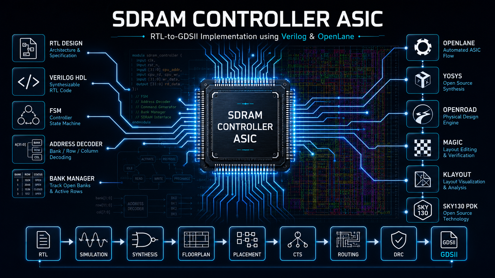
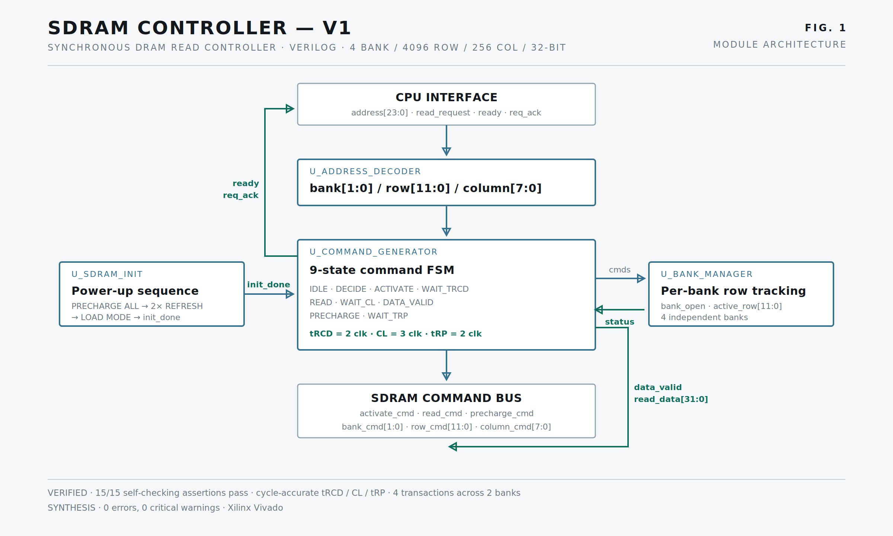
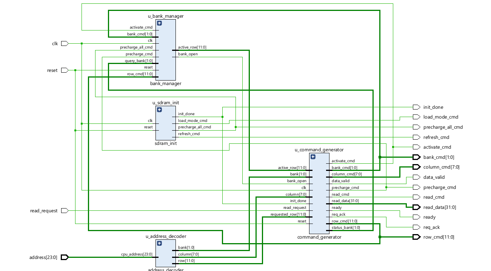
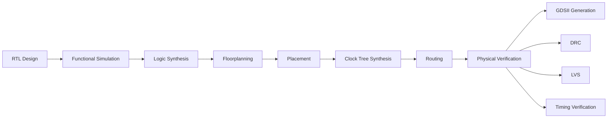
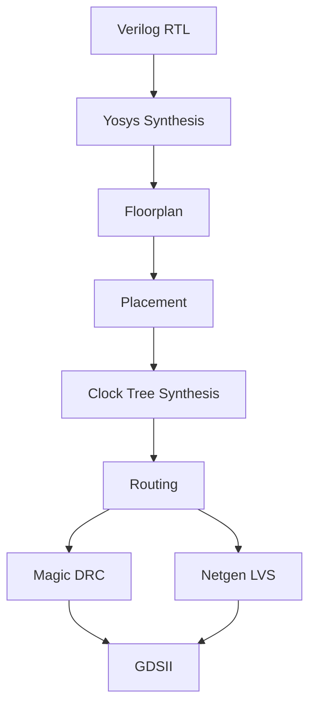
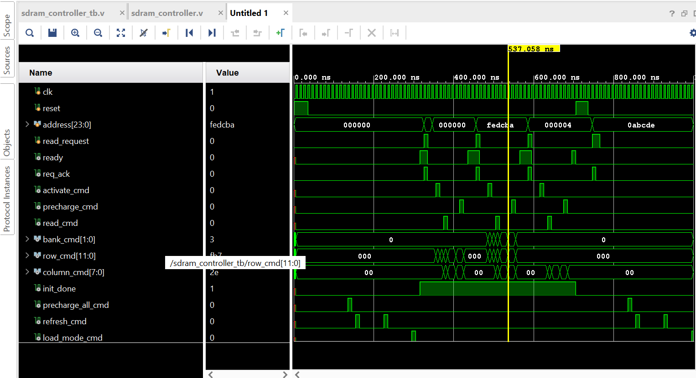
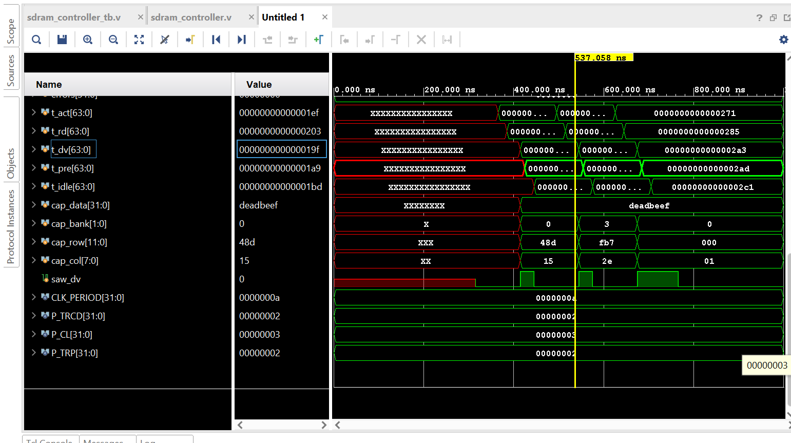
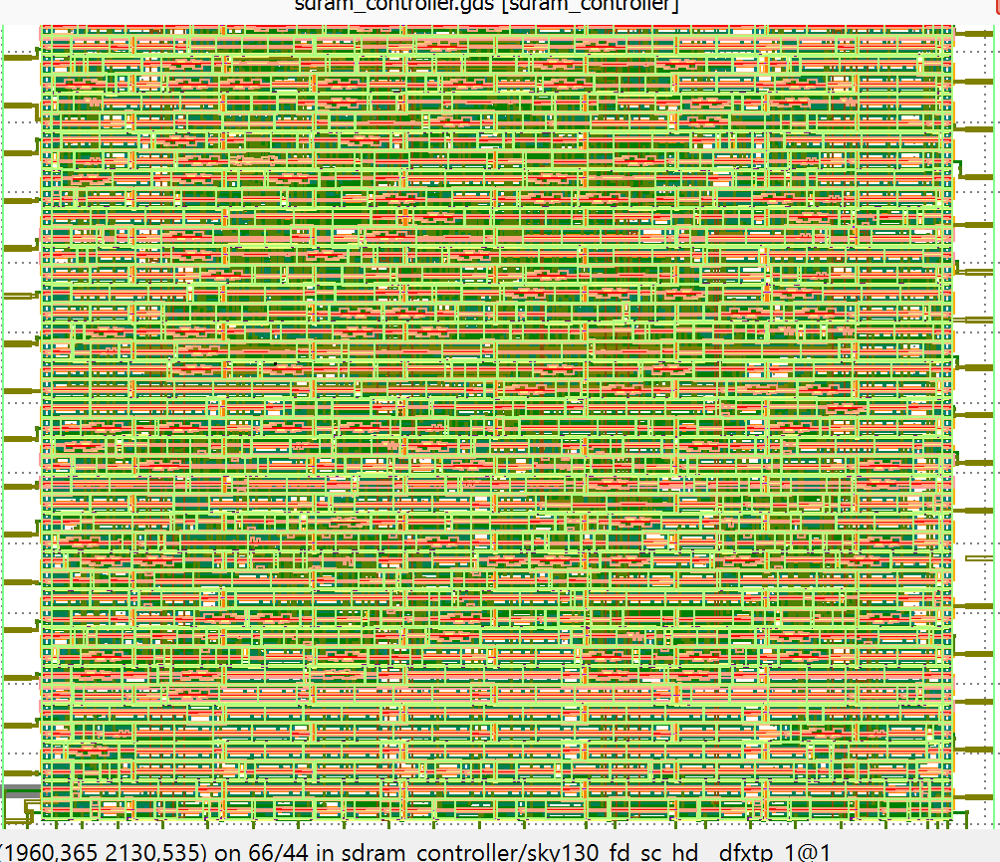

<p align="center">

</p>

# SDRAM Controller ASIC

> **RTL-to-GDSII Implementation using Verilog, OpenLane and SKY130**



</p>

---

## Overview

This repository presents the complete implementation of a **Single Data Rate (SDR) SDRAM Controller ASIC**, taking the design from **Register Transfer Level (RTL)** to a manufacturable **GDSII layout** using a fully open-source ASIC design flow.

The controller is developed in synthesizable **Verilog-2001** and implemented using **OpenLane** with the **SkyWater SKY130 Process Design Kit (PDK)**. The project demonstrates the complete digital ASIC development methodology followed in modern semiconductor design.

### What is SDRAM?

**Synchronous Dynamic Random Access Memory (SDRAM)** is a volatile memory technology that operates synchronously with a system clock. Unlike asynchronous DRAM, SDRAM performs all operations—including initialization, activation, read, write, and refresh—in synchronization with the clock, enabling higher throughput and predictable timing.

Key characteristics include:

- Clock-synchronous operation
- Multiple memory banks
- Row and column addressing
- Burst transfer capability
- High memory density
- Deterministic timing constraints

---

### Why is an SDRAM Controller Required?

Raw SDRAM devices cannot be directly interfaced with processors or digital logic because they require strict command sequencing and timing management.

An SDRAM controller acts as the interface between the processing system and external memory by handling:

- SDRAM initialization sequence
- Command generation
- Address translation
- Bank management
- Timing constraint enforcement
- Read operation control
- Clock synchronization

Without a controller, reliable communication with SDRAM is not possible.

---

### Why ASIC Implementation?

Although SDRAM controllers are commonly prototyped on FPGAs, implementing the design as an **Application-Specific Integrated Circuit (ASIC)** provides valuable experience in industrial digital IC development.

ASIC implementation introduces additional design stages beyond RTL development, including:

- Logic synthesis
- Physical floorplanning
- Standard-cell placement
- Clock Tree Synthesis (CTS)
- Global and detailed routing
- Design Rule Checking (DRC)
- Layout Versus Schematic (LVS)
- GDSII generation for fabrication

This repository demonstrates each of these stages using an entirely open-source toolchain.

---

### What This Repository Demonstrates

This project showcases an end-to-end ASIC implementation workflow, including:

- RTL development using Verilog
- Modular hardware architecture
- Functional simulation and verification
- Logic synthesis using Yosys
- Physical implementation with OpenLane
- OpenROAD-based place-and-route
- Timing-driven optimization
- Physical verification
- Manufacturable GDSII generation

It serves as a practical reference for:

- ASIC Design Engineers
- RTL Designers
- FPGA Engineers transitioning to ASIC
- VLSI Students
- Recruiters evaluating digital design portfolios

---

## Features

The current implementation includes the following functionality.

### Implemented

- [x] RTL Design
- [x] Address Decoder
- [x] Bank Manager
- [x] Initialization FSM
- [x] Command Generator
- [x] Read Support
- [x] Timing Controller
- [x] Vivado Functional Verification
- [x] OpenLane ASIC Flow
- [x] Floorplanning
- [x] Placement
- [x] Clock Tree Synthesis (CTS)
- [x] Routing
- [x] Design Rule Check (DRC)
- [x] GDSII Generation

---

### Future Work

The following features are planned for future releases and are **not part of the current implementation**.

- [ ] Write Support
- [ ] Auto Refresh Controller
- [ ] Burst Read
- [ ] Burst Write
- [ ] FIFO Interface
- [ ] AXI4-Lite Interface
- [ ] APB Interface
- [ ] Wishbone Interface
- [ ] DDR Memory Support
- [ ] ECC Support
- [ ] Low Power Modes
- [ ] Static Timing Optimization
- [ ] Multi-Bank Scheduler

> **Note**
>
> Only the features listed under **Implemented** are included in the current project. Items under **Future Work** represent planned enhancements.

---

# Architecture



The SDRAM Controller follows a modular architecture in which each hardware block is responsible for a dedicated function. This modular organization simplifies verification, improves maintainability, and enables future feature expansion.

---

## Top-Level Architecture

```text
                   +--------------------------------------+
                   |         SDRAM Controller             |
                   |                                      |
                   |  +------------------------------+    |
CPU Interface ---> |  | Address Decoder              |    |
                   |  +------------------------------+    |
                   |                 |                    |
                   |                 v                    |
                   |  +------------------------------+    |
                   |  | Bank Manager                 |    |
                   |  +------------------------------+    |
                   |                 |                    |
                   |                 v                    |
                   |  +------------------------------+    |
                   |  | Initialization FSM           |    |
                   |  +------------------------------+    |
                   |                 |                    |
                   |                 v                    |
                   |  +------------------------------+    |
                   |  | Command Generator            |    |
                   |  +------------------------------+    |
                   |                 |                    |
                   +-----------------|--------------------+
                                     |
                                     v
                                 SDR SDRAM
```

---

## Module Descriptions

### Address Decoder

The Address Decoder receives the incoming memory address and separates it into SDRAM-specific address fields.

Responsibilities:

- Decode row address
- Decode column address
- Decode bank address
- Generate internal address signals
- Forward decoded information to the controller

---

### Bank Manager

The Bank Manager controls access to the SDRAM memory banks.

Responsibilities include:

- Bank selection
- Active bank tracking
- Bank status management
- Bank activation control
- Coordination with timing controller

---

### Initialization FSM

The Initialization Finite State Machine performs the mandatory SDRAM power-up sequence defined by the JEDEC specification.

Typical operations include:

- Power stabilization delay
- PRECHARGE ALL command
- AUTO REFRESH cycles
- Mode Register programming
- Transition to normal operating mode

This module ensures the memory is fully initialized before accepting transactions.

---

### Command Generator

The Command Generator converts controller requests into valid SDRAM commands.

Supported command generation includes:

- NOP
- ACTIVE
- READ
- PRECHARGE
- LOAD MODE REGISTER

Each command is issued while respecting SDRAM timing requirements.

---

### Top Module

The Top Module integrates all functional blocks into a single synthesizable design.

Its responsibilities include:

- Module instantiation
- Signal routing
- Clock distribution
- Reset handling
- Controller coordination
- SDRAM interface generation

The top-level module serves as the primary entry point for synthesis, simulation, and physical implementation.

---

# RTL Module Hierarchy



The RTL hierarchy follows a modular design philosophy, enabling each functional block to be independently developed, simulated, and verified before full-chip integration.

```text
sdram_controller_top
│
├── address_decoder
│
├── bank_manager
│
├── initialization_fsm
│
├── command_generator
│
├── timing_controller
│
└── sdram_interface
```

---

### Hierarchy Overview

| Module | Description |
|----------|-------------|
| `sdram_controller_top` | Top-level integration module |
| `address_decoder` | Decodes incoming SDRAM addresses |
| `bank_manager` | Controls SDRAM bank selection and status |
| `initialization_fsm` | Executes JEDEC initialization sequence |
| `command_generator` | Generates SDRAM control commands |
| `timing_controller` | Enforces SDRAM timing constraints |
| `sdram_interface` | Drives external SDRAM signals |

---

> **Design Philosophy**
>
> Each RTL module has a clearly defined responsibility and communicates through well-defined interfaces. This modular structure improves readability, verification efficiency, and future scalability while aligning with industry-standard ASIC design practices.

# ASIC Design Flow

The controller follows a standard digital ASIC implementation flow beginning with RTL development and ending with a fabrication-ready GDSII layout.

Each stage transforms the design into a progressively more physical representation while ensuring functionality, timing, and manufacturability.

---

## 1. RTL Design

The design is written using synthesizable **Verilog-2001**.

Primary activities include:

- RTL architecture
- FSM implementation
- Module integration
- Coding for synthesis
- Lint-friendly design practices

**Output**

- Synthesizable Verilog source

---

## 2. Functional Simulation

Before synthesis, the RTL is verified using a behavioral testbench.

Simulation validates:

- Reset behavior
- SDRAM initialization
- Address decoding
- Command generation
- Read transactions
- Controller state transitions

Waveforms are inspected to confirm expected functionality.

**Output**

- Simulation logs
- Waveform files
- Functional verification report

---

## 3. Logic Synthesis

RTL is synthesized into a gate-level netlist using **Yosys**.

During synthesis:

- RTL is optimized
- Standard cells are selected
- Logic is mapped to SKY130 libraries
- Area and timing reports are generated

**Output**

- Gate-level netlist
- Area report
- Timing estimates

---

## 4. Floorplanning

Floorplanning defines the physical layout of the chip.

Tasks include:

- Core sizing
- Die sizing
- IO pin placement
- Power distribution planning
- Macro placement (if applicable)

**Output**

- Initial chip floorplan

---

## 5. Placement

During placement, every synthesized standard cell is assigned an optimal physical location.

Objectives:

- Minimize wirelength
- Improve timing
- Reduce congestion
- Improve routability

**Output**

- Placed standard-cell layout

---

## 6. Clock Tree Synthesis (CTS)

Clock Tree Synthesis distributes the clock signal throughout the design while minimizing skew and insertion delay.

CTS performs:

- Buffer insertion
- Clock balancing
- Clock optimization
- Skew reduction

**Output**

- Balanced clock network

---

## 7. Routing

Routing connects all standard cells using the available metal layers.

This stage includes:

- Global routing
- Detailed routing
- Timing refinement
- Antenna repair
- Congestion reduction

**Output**

- Fully routed layout

---

## 8. Physical Verification

The completed layout undergoes signoff verification.

Verification includes:

### Design Rule Check (DRC)

Ensures that the layout complies with manufacturing design rules.

### Layout Versus Schematic (LVS)

Confirms that the physical layout matches the synthesized netlist.

### Antenna Checks

Identifies manufacturing risks caused by excessive metal charge accumulation.

### Timing Verification

Confirms timing closure under defined constraints.

---

## 9. GDSII Generation

After successful verification, the final layout is exported as a **GDSII** database.

The generated GDSII file is the fabrication-ready representation of the ASIC.

---

# Complete ASIC Flow



---

## OpenLane-Based Implementation Flow



---

> **Implementation Note**
>
> The physical implementation is performed using the open-source **OpenLane** flow on the **SkyWater SKY130** Process Design Kit, enabling a complete RTL-to-GDSII workflow without proprietary EDA tools.

---

# Functional Verification

Functional verification ensures that the RTL behaves as intended before physical implementation begins.

The controller is verified using a dedicated Verilog testbench executed in the Vivado simulation environment.

---

## Verification Objectives

The simulation validates:

- Controller reset sequence
- SDRAM initialization FSM
- Address decoding logic
- Bank selection
- Command generation
- Read transaction behavior
- State machine transitions
- Timing relationships between control signals

---

## Testbench Overview

The verification environment consists of:

```text
                +-------------------------+
                |    Testbench            |
                +------------+------------+
                             |
                             v
                  +-----------------------+
                  | SDRAM Controller RTL  |
                  +-----------+-----------+
                              |
                              v
                     Monitored Outputs
```

The testbench generates stimulus, applies clock and reset signals, and observes the controller outputs to verify expected behavior.

---

## Simulation Process

The verification flow consists of:

1. Compile RTL modules.
2. Compile the testbench.
3. Apply reset.
4. Execute SDRAM initialization.
5. Stimulate read transactions.
6. Monitor generated commands.
7. Inspect simulation waveforms.
8. Verify expected state transitions.

---

## Simulation Results




The waveform demonstrates successful controller initialization and correct command sequencing during simulation.

---

# Physical Design Results

The following figures summarize each major stage of the ASIC implementation flow.

Image placeholders are provided and can be replaced with screenshots from OpenLane, Magic, or KLayout after implementation.

n.

---

## Final GDSII



The GDSII database represents the final fabrication-ready layout generated by the OpenLane flow.

-

The layout can be inspected in Magic to verify geometry, routing quality, and layer implementation.

---

##[Final GDSII](Documentation/images/physical_layout.png)

The final design is verified against the SKY130 design rules before signoff. Any reported violations should be resolved before fabrication.
# Future Roadmap

The project roadmap outlines planned enhancements for future releases.

---

## Version 1.0

### Completed

- ✅ RTL Architecture
- ✅ Address Decoder
- ✅ Bank Manager
- ✅ Initialization FSM
- ✅ Command Generator
- ✅ Read Support
- ✅ Functional Verification
- ✅ OpenLane Integration
- ✅ Floorplanning
- ✅ Placement
- ✅ Clock Tree Synthesis
- ✅ Routing
- ✅ DRC
- ✅ GDSII Generation

---

## Version 2.0 (Planned)

> **Future Work**

- [ ] Write Support
- [ ] Auto Refresh Controller
- [ ] Burst Read
- [ ] Burst Write
- [ ] FIFO Buffer
- [ ] AXI4-Lite Interface
- [ ] APB Interface
- [ ] Wishbone Interface
- [ ] Improved Timing Controller
- [ ] Enhanced Verification Environment

---

## Version 3.0 (Planned)

> **Long-Term Goals**

- [ ] DDR SDRAM Support
- [ ] ECC (Error Correcting Code)
- [ ] Low Power Operation
- [ ] Dynamic Power Optimization
- [ ] Static Timing Optimization
- [ ] Multi-Bank Scheduler
- [ ] Multi-Clock Support
- [ ] UVM Verification Environment

---

# How to Run

## Prerequisites

Install the following software before running the project.

- Git
- Docker
- OpenLane
- Vivado
- GTKWave

---

## Clone the Repository

```bash
git clone https://github.com/your-username/SDRAM_Controller_ASIC.git

cd SDRAM_Controller_ASIC
```

---

## Run Functional Simulation (Vivado)

Launch Vivado and add the RTL and testbench files.

Alternatively, using Tcl:

```tcl
read_verilog rtl/*.v
read_verilog tb/tb_sdram_controller.v

launch_simulation
run all
```

View the generated waveforms to verify controller functionality.

---

## Run the OpenLane Flow

Navigate to the OpenLane configuration directory.

```bash
cd openlane
```

Run the implementation flow.

```bash
make
```

or

```bash
flow.tcl -design .
```

After successful execution, implementation results are generated inside the `runs/` directory.

---

## Generated Outputs

```text
runs/

├── synthesis/
├── floorplan/
├── placement/
├── cts/
├── routing/
├── signoff/
└── final/
```

---

# Results Summary

The following table summarizes the implementation status of the project.

| Stage | Status | Remarks |
|--------|--------|---------|
| RTL Development | ✅ Complete | Synthesizable Verilog |
| Functional Simulation | ✅ Complete | Verified using Vivado |
| Logic Synthesis | ✅ Complete | OpenLane / Yosys |
| Floorplanning | ✅ Complete | OpenROAD |
| Placement | ✅ Complete | Standard-cell placement |
| Clock Tree Synthesis | ✅ Complete | CTS completed |
| Routing | ✅ Complete | Detailed routing |
| DRC | ✅ Complete | Design rule verification |
| GDSII Generation | ✅ Complete | Fabrication-ready layout |

---

## Deliverables

The project generates the following implementation artifacts.

| Output | Description |
|---------|-------------|
| RTL Source | Verilog implementation |
| Netlist | Synthesized gate-level netlist |
| Reports | Area, timing, utilization |
| DEF | Placement database |
| LEF | Technology description |
| GDSII | Final layout |
| DRC Reports | Physical verification |
| Logs | Complete OpenLane execution logs |

---

# References

The following resources were used during the development of this project.

### Standards

- JEDEC SDR SDRAM Standard
- Verilog IEEE 1364-2001 Standard

---

### ASIC Design

- OpenLane Documentation
- OpenROAD Documentation
- Yosys Documentation
- SkyWater SKY130 PDK Documentation

---

### Physical Design

- Magic VLSI Layout Tool
- KLayout Layout Viewer

---

### Verification

- Xilinx Vivado Design Suite
- GTKWave Waveform Viewer

---

# License

This project is licensed under the **MIT License**.

```text
MIT License

Copyright (c) 2026

Permission is hereby granted, free of charge,
to any person obtaining a copy of this software
and associated documentation files...
```

See the `LICENSE` file for the complete license text.

---

# Author

## Durg Pratap Singh

**Electronics and Communication Engineering**

Passionate about:

- ASIC Design
- RTL Design
- Physical Design
- Embedded Systems
- VLSI Engineering

---

### Connect

**GitHub**

```text
https://github.com/Durgpratap07
```

**LinkedIn**

```text
https://www.linkedin.com/in/durg-pratap-singh-918837226/
```

**Email**

```text
durgpratapsingh07@gmail.com
```

---

## Acknowledgements

This project leverages the open-source digital ASIC ecosystem made possible by:

- OpenLane
- OpenROAD
- Yosys
- SkyWater Technology
- CHIPS Alliance
- The Open-Source Silicon Community

Their contributions have significantly advanced accessible ASIC design and education.

---

